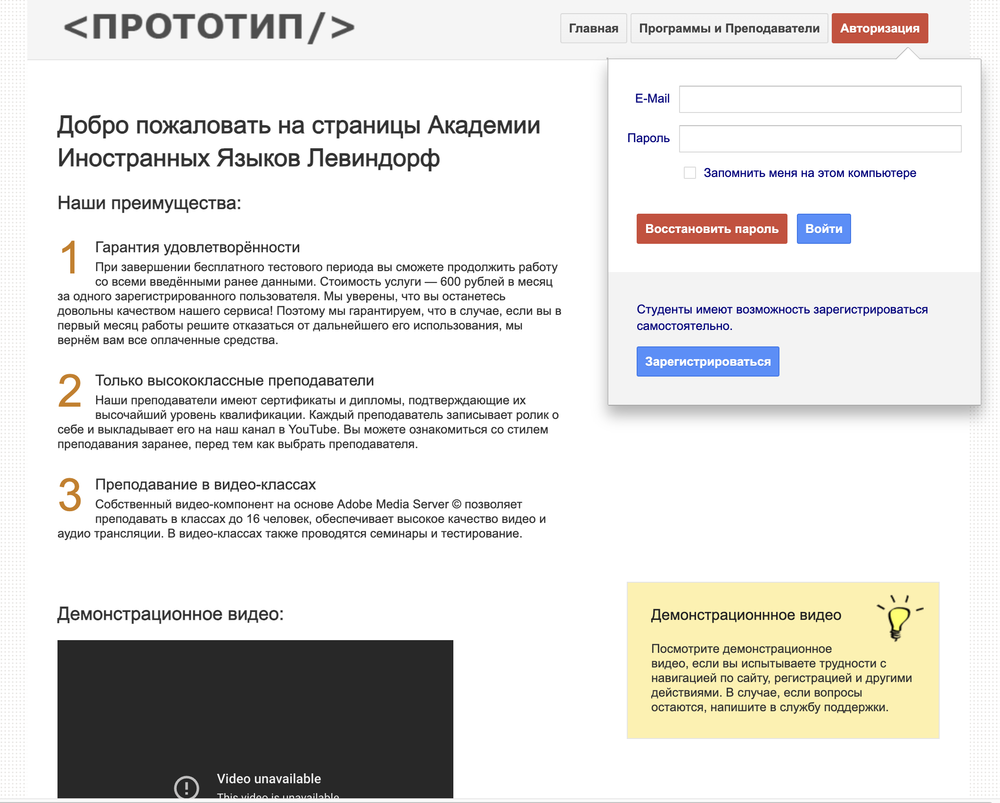

# E-learning prototype in GWTP
#### 2011 - 2012

This project is an effort to bring the old code back with the help of Groovy build system and Docker deployment stack. The technological basis for the project is discontinued in 2017, with the last release of Arcbees GWTP. However, this code uses an earlier version of GWTP 0.6. It also relies on Java 1.6 and some other older libraries, some of them are nowhere to be found.

Luckily, the compiled web archive is available under /war folder in the root of the repository and it is runnable in Docker Tomcat 7 container:




## Quick Start

Checkout the code and run the build:

```
git 'https://github.com/grauds/clematis.poc.gwtp.git'
cd clematis.poc.gwtp
chmod +x ./gradlew
./gradlew build
```

Gradle uses Java annotation processors shipped with GWTP to generate Action classes and ActionResult classes:

```groovy!
annotationProcessor('com.gwtplatform:gwtp-all:1.0','com.google.gwt:gwt-user:2.8.2')
```

Next step is to compile GWT client code with a help of Gradle GWT plugin :

```groovy
plugins {
    id 'java'
    id "de.esoco.gwt" version "1.2.0"
}
```
The plugin automatically hooks up into the project after Java compilation and has a number of useful arguments, including version of GWT to compile the code with. The required parameter is the name of the module to compile:

```groovy
gwt {
    module 'org.clematis.web.elearning.ELP'
}
```

## Docker Deployment

At this stage deployment is trivial:

```dockerfile
FROM tomcat:7.0-jdk8-corretto

RUN mkdir -p /usr/local/tomcat/webapps/elp
COPY war/ /usr/local/tomcat/webapps/elp
```
